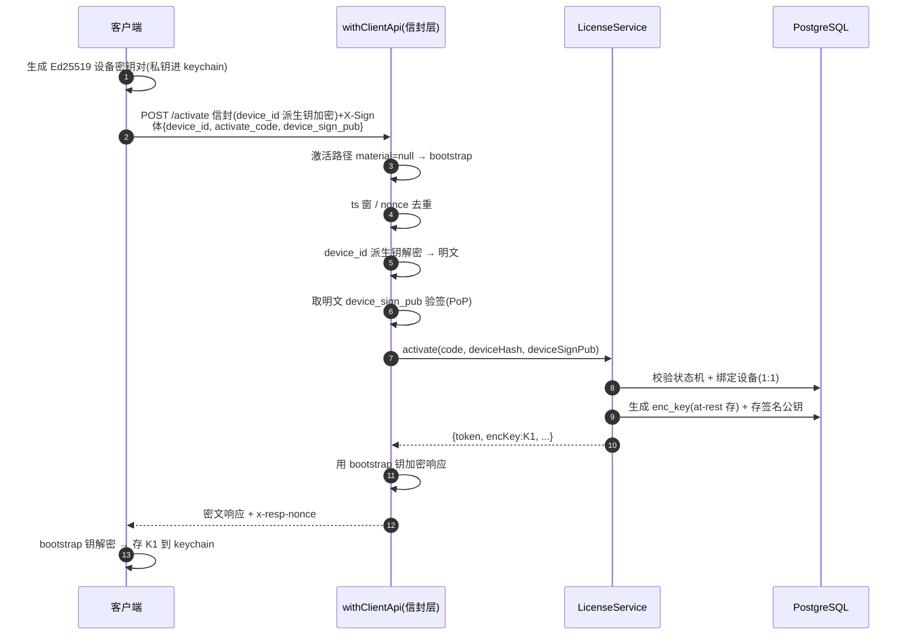
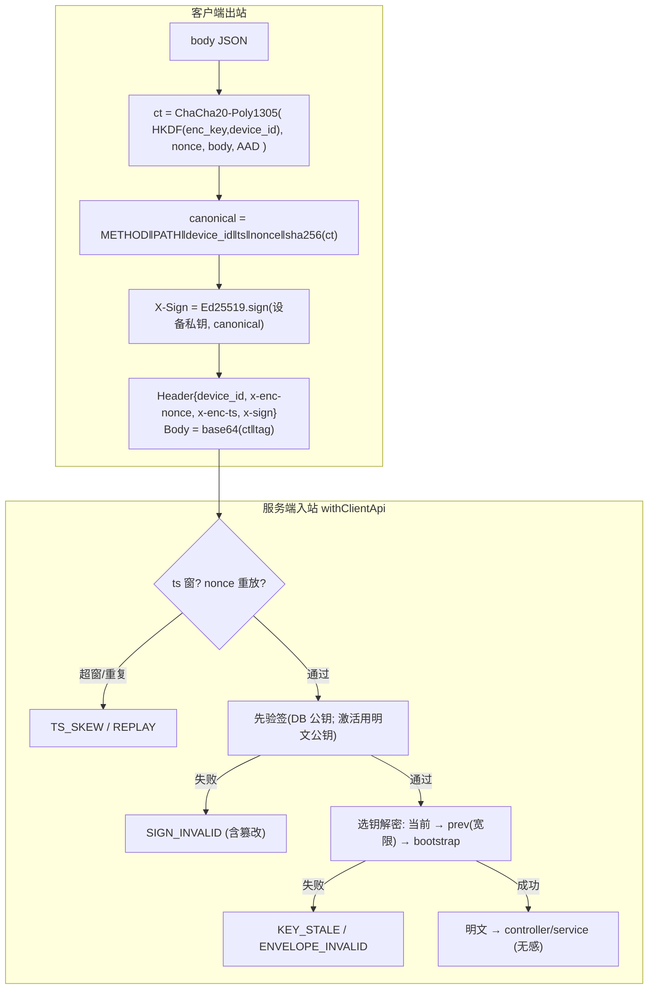
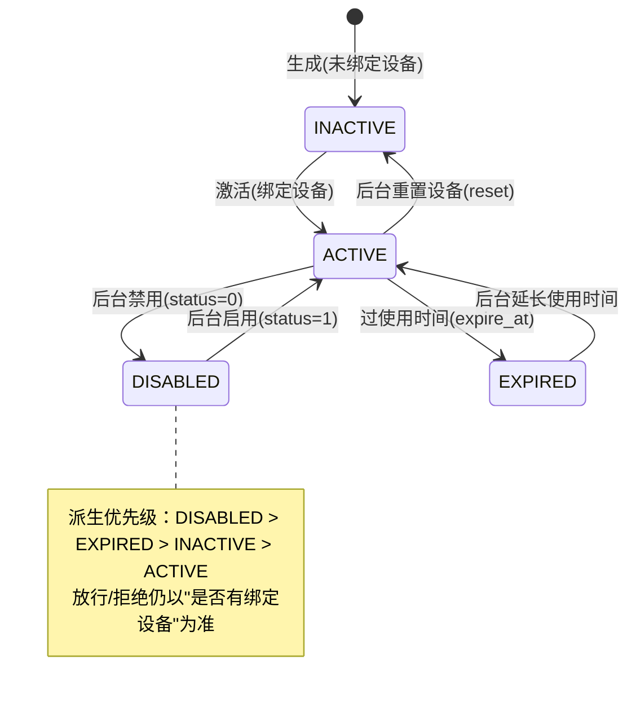

# admin-service 后端 Wiki

> 桌面客户端「授权运营服务端」。基于 Next.js 14（App Router）+ PostgreSQL + Prisma 6。
> 一套服务同时承载 **后台运营（`/api/*`，antd 后台）** 与 **前台客户端（`/api/client/*`，桌面端）** 两个表面，共享同一业务/数据层。
>
> **最近更新（2026-07-24）**：新增特效模板匹配日志批量采集与后台只读查询。采集使用独立表、严格客户端鉴权和正文日志保护；后台支持精确组合筛选与 owner 行级权限。

目录：
- [模块一 · 后台（运营）](#模块一后台运营)
- [模块二 · 前台（客户端 API）](#模块二前台客户端-api)
- [模块三 · 运维部署](#模块三运维部署)
- [模块四 · 代码架构与规范](#模块四代码架构与规范)

---

## 模块一·后台（运营）

### 1.1 功能总览

后台是「菜单驱动 RBAC」的运营管理台。所有后台 API 的放行依据是 **当前管理员可见菜单是否包含该功能菜单**（`requireMenu('/xxx')`），与前端路由守卫口径一致。

| 功能 | 菜单 key | 主要接口 | 说明 |
|---|---|---|---|
| 登录/会话 | — | `POST /api/user/login`·`logout`、`GET /api/check` | 账号**或**邮箱 + 密码；Cookie JWT；`/check` 返回 `{user, authority(角色code[]), menus(按角色聚合的树)}` |
| 管理员管理 | `/user` | `GET/POST /api/admin`、`PUT/DELETE /api/admin/[id]`、`POST /api/admin/roles` | 管理员 CRUD、搜索分页、分配角色。编辑仅改 姓名/状态/重置密码（邮箱、角色不在编辑表单） |
| 角色/权限 | `/permission` | `GET/POST /api/role`、`PUT/DELETE /api/role/[id]`、`GET /api/menu` | 角色 CRUD + 菜单树勾选；内置角色禁删、禁改菜单/状态 |
| 卡密管理 | `/license` | `GET/POST /api/license`、`PUT /api/license/[id]`、`POST /api/license/status`·`reset`·`quota`·`expert-mode`、`GET /api/license/[id]/logs` | 当前模式配额、用量、剩余和不限量统一在卡密页管理；见 [1.3 卡密重点业务](#13-卡密重点业务) |
| 版本管理 | `/app-version` | `GET/POST /api/app-version`、`PUT /api/app-version/[id]`、`POST /api/app-version/upload` | 客户端版本发布（平台/版本/最低版本/灰度）；**安装包经 `upload` 传 WCS 后自动回填下载地址（禁手工填）** |
| 资源包管理 | `/resource-pack` | `GET/POST /api/resource-pack`、`PUT /api/resource-pack/[id]`、`POST /api/resource-pack/upload` | 资源包发布（packId/版本/**平台**/sha256/url）；文件经 `upload` 传 WCS 回填 url/sha256/size；**平台 `general`通用 / `win` / `mac`，默认通用** |
| 埋点看板 | `/telemetry` | `GET /api/telemetry/events`（明细）、`/stats`（聚合） | 明细含 卡密/设备/事件/版本/**IP**/时间；支持按完整设备号、完整卡密、时间区间检索 |
| QA 对话数据集 | `/qa-conversations` | `GET /api/qa-conversations` | 只读分页列表；按采集时完整设备号精确搜索；菜单权限与卡密归属行级权限叠加 |
| 审计日志查看 | `/audit` | `GET /api/audit`、`GET /api/audit/options` | 全系统只读审计；按时间、管理员、操作类型和关键词组合筛选；无 owner 行级过滤 |
| 系统配置 | `/config` | `GET/POST /api/config`、`PUT/DELETE /api/config/[id]` | 非敏感运行时配置 CRUD；key 不可变；写入和审计同事务提交 |
| 特效模板匹配日志 | `/template-match-logs` | `GET /api/template-match-logs`、`GET /api/template-match-logs/[id]` | 只读分页与详情；三个标识精确搜索、时间和匹配状态筛选；菜单权限与卡密 owner 行级权限叠加 |
| 数据大盘 | `/`（数据大盘） | `GET /api/dashboard/stats` | 累计/今日激活、近 7 天活跃卡密、每日激活折线（时间筛选） |
| API 文档 | — | `GET /api/docs`（Swagger UI）、`GET /api/openapi` | |

**鉴权模型**
- **功能权限（菜单驱动）**：`requireMenu('/license')` = 校验当前管理员可见菜单树是否包含该 key；超管拥有全部菜单，被授予对应菜单的自定义角色亦可用；无菜单者 403。
- **数据权限（行级）**：卡密等资源含 `owner_admin_id`。普通管理员仅能查询/操作**自己 owner** 的资源；超管不限。由 controller 注入 `ctx={adminId, isSuper}` 交 service 校验（`assertOwned` 防越权 IDOR）。

### 1.2 数据表描述

> 约束（全表）：主键 `id Int 自增`；`relationMode="prisma"` **无物理外键**（标量列 + `@@index` + 显式连接表）；表名 snake_case。

**A. 后台 RBAC**

| 表 | 说明 | 关键字段 |
|---|---|---|
| `admins` | 后台管理员（与客户端用户解耦） | `username`(唯一)、`email`(唯一)、`password_hash`、`name`、`status`(1/0)、`avatar` |
| `roles` | 角色 | `code`(唯一)、`name`、`builtin`、`status` |
| `menus` | 菜单（权限单一数据源，来自 `prisma/seed-data/menus.json`） | `key`(唯一)、`i18n_key`、`label`、`parent_key`、`sort`、`status` |
| `admin_roles` | 管理员↔角色（显式连接表） | `admin_id`、`role_id` |
| `role_menus` | 角色↔菜单（显式连接表） | `role_id`、`menu_id` |

**B. 客户端授权 / 卡密**

| 表 | 说明 | 关键字段 |
|---|---|---|
| `client_licenses` | 卡密主表 | `code`(唯一)、`status`(1正常/0禁用)、`expire_at`(使用时间上限,可空=不限)、`activated`、`owner_admin_id`(归属)、`ai_free_quota`、`llm_used`、`max_llm`、`expert_mode`(专家模式开关,默认 false)、`allow_custom_api_key`(SmallInt，0禁止/1允许自配 AI 密钥，默认 0)、`last_active_at`(最近活跃)、`remark` |
| `license_devices` | 设备绑定（一卡一台，`license_id` 唯一 = 1:1） | `device_hash`、`last_heartbeat_at`、**`enc_key`/`prev_enc_key`/`key_rotated_at`**(信封会话密钥, at-rest 加密)、**`device_sign_pub`**(设备签名公钥) |
| `license_device_logs` | 绑定日志（activate/reset 历史） | `license_id`、`device_hash`、`action`、`operator_admin_id` |
| `offline_token_logs` | 离线令牌签发流水 | `license_id`、`device_id`、`nonce`、`expire_at` |

**C. AI / 分发 / 埋点 / 审计**

| 表 | 说明 | 关键字段 |
|---|---|---|
| `ai_quotas` | AI 额度 | `license_id`、`used_count`、`unlimited` |
| `ai_usage_logs` | AI 调用流水（无素材内容） | `license_id`、`kind`、`status` |
| `app_versions` | 客户端版本 | `platform`(win/mac)、`version`、`min_client_version`、`url`、`signature`、`gray_percent` |
| `resource_packs` | 资源包 | `pack_id`、`version`、`url`、`sha256`、`min_client_version`、`platform`(general/win/mac，默认 general，`@@index`) |
| `telemetry_events` | 埋点明细（白名单字段，无创作内容） | `license_id`、`device_id`、`event`、`props_json`、`client_version`、**`ip`**、`created_at` |
| `qa_conversation_samples` | QA 单轮原始语料（追加写入） | `license_id`、采集时 `device_id` 快照、透传 `session_id`、`user_message`、`reply_message`、`created_at` |
| `template_match_logs` | 特效模板逐句匹配诊断日志（追加写入） | `license_id`、`session_id`、`template_id`、`original_text`、`wrapped_text`、`client_version`、`platform`、`asr_model`、`created_at` |
| `audit_logs` | 后台操作审计 | `actor_admin_id`、`action`、`target_type`、`target_id`、`detail`(含改前/改后) |
| `configs` | 非敏感运行时配置 | `key`(唯一且创建后不可变)、`value`(TEXT)、`type`(SMALLINT：1 string / 2 int / 3 json / 4 boolean)、`created_at`、`updated_at` |

### 1.3 卡密重点业务

卡密是整个授权体系的核心。按运营身份（**销售 / 客服 / 开发**）划分典型职责——身份即「被授予不同菜单 + 行级归属」的 RBAC 角色：

```
   销售(sales)                客服(support)               开发/超管(dev/admin)
   ├ 批量生成卡密(归属自己)     ├ 用户换机→重置设备绑定       ├ 全量可见(超管不限行级)
   ├ 调整使用时间/备注          ├ 违规→禁用; 恢复→启用        ├ 配置菜单/角色/系统
   └ 只看/管自己 owner 的卡密   └ 调整该卡 LLM 次数上限        └ AI 额度/版本/资源包/审计
   （行级数据权限：普通管理员仅本人 owner；超管全部）
```

**卡密生命周期与操作**

| 操作 | 接口 | 效果 | 备注 |
|---|---|---|---|
| 批量生成 | `POST /api/license` `{count, days?, remark?}` | 生成 N 个唯一卡密，`owner_admin_id=当前管理员` | days 留空=使用时间不限 |
| 列表（多维筛选） | `GET /api/license?keyword=&page=&pageSize=&ownerAdminId=&activated=&deviceId=&activeFrom=&activeTo=` | 普通管理员只见自己 owner 的；含 `maxLlmLimit`(全局上限)。筛选：`ownerAdminId`(归属,**仅超管**,普通管理员忽略)、`activated`(激活 1已激活/0未激活)、`deviceId`(设备号**全等精准**)、`activeFrom`/`activeTo`(最近活跃闭区间,前端传满端点)；全部与关键词/行级权限 **AND** 叠加 | 状态列前端计算四态 |
| 调整时间/备注 | `PUT /api/license/[id]` `{expireAt?, remark?}` | 改使用时间上限/备注 | `assertOwned` |
| **启用/禁用**（取代删除） | `POST /api/license/status` `{id, status}` | `status=0` 立即失效（客户端下次心跳被强制下线）；`=1` 恢复 | **卡密不可删除** |
| 重置设备绑定 | `POST /api/license/reset` `{id}` | 删除设备行 → 用户可在新机重激活；连带清空该设备 `enc_key`/签名公钥 | 换机场景 |
| 设置 LLM 次数 | `POST /api/license/max-llm` `{id, maxLlm}` | 改 `max_llm`；受全局 `MAX_LLM_LIMIT`(默认 50) 封顶，越界拒（6003） | 默认 10 |
| 设置专家模式 | `POST /api/license/expert-mode` `{id, expertMode}` | 逐卡密开/关 `expert_mode`；`assertOwned` 数据权限，审计记录改前/改后（`license.setExpertMode`） | 前端 Switch；前台 `GET /api/client/expert-mode` 读取 |
| 设置自配密钥权限 | `POST /api/license/custom-api-key` `{id, allowCustomApiKey}` | 逐卡密写入 `allow_custom_api_key=1/0`；复用 `assertOwned`，审计动作 `license.setAllowCustomApiKey` | 前端 Switch；成功心跳下发 `allowCustomApiKey: 0/1` |
| 操作日志 | `GET /api/license/[id]/logs` | 该卡的绑定/操作历史 | |

**卡密有效性 = 状态机（四态，`resolveLicenseState`）**：优先级 `DISABLED(status≠1)` > `EXPIRED(过使用时间)` > `INACTIVE(无绑定设备)` > `ACTIVE`。activate/heartbeat/鉴权/后台展示统一此口径。

### 1.4 QA 对话数据集采集与后台查询

该功能用于收集客户端本地 QA 场景中的单轮原始对话，供后续数据清洗、质量审核和训练准备使用。QA 推理仍由客户端直连 LLM，服务端只保存客户端显式上报的内容。

**数据流**

```text
客户端完成一轮 QA
  -> 用户知情同意上传
  -> POST /api/client/qa-conversations
  -> 服务端从鉴权上下文取得 license_id 和 device_id
  -> 向 qa_conversation_samples 追加一行
  -> 后台 /qa-conversations 按权限只读查询
```

**客户端采集接口**

| 项目 | 说明 |
|---|---|
| 路径 | `POST /api/client/qa-conversations` |
| 鉴权 | 请求头 `device_id`、`activate_code`，复用现有请求签名与安全信封 |
| 请求体 | `session_id`、`user_message`、`reply_message` |
| 归属字段 | `license_id` 和 `device_id` 只取服务端鉴权上下文，客户端传入同名字段不会生效 |
| 写入语义 | 仅追加，不更新、不覆盖、不删除；不限频、不计配额、不去重、不幂等 |
| 成功响应 | `{ id, createdAt }`，前台统一信封为 `{ code: 200, data, msg: "提交成功" }` |

`session_id` 只做 JSON 字符串类型检查，服务端原样保存，不校验空值、长度、格式、真实性、唯一性或会话归属。`user_message` 和 `reply_message` trim 后必须非空，各自的 UTF-8 编码不得超过 64 KiB，但数据库保存客户端原值。客户端请求失败后不得自动重试，以免在没有事件 ID 的情况下产生无法识别的重复样本。

**后台页面与接口**

| 项目 | 说明 |
|---|---|
| 页面 | `/qa-conversations`，菜单名称“QA 对话数据集” |
| 接口 | `GET /api/qa-conversations?page=1&pageSize=10&deviceId=<完整设备号>` |
| 查询 | `page >= 1`；`pageSize` 为 1-100；`deviceId` 仅支持 trim 后的完整设备号精确匹配 |
| 列表字段 | ID、卡密 ID、设备号、Session ID、用户消息、LLM 回复、创建时间 |
| 查看详情 | 点击查看按钮打开只读弹窗，展示完整用户消息和 LLM 回复 |
| 操作边界 | 不提供新增、编辑、删除、批量操作或导出能力 |

后台访问同时执行两层授权：先由 `requireMenu('/qa-conversations')` 校验菜单权限，再按卡密 `owner_admin_id` 限制数据范围。超级管理员可查看全部样本；普通管理员只能查看归属于自己的卡密产生的样本。菜单迁移仅自动授权内置 `admin` 角色，自定义角色需要运营人员在角色权限页显式勾选。

**存储、迁移与安全**

- 表 `qa_conversation_samples` 保存 `license_id`、采集时 `device_id` 快照、`session_id`、`user_message`、`reply_message`、`created_at`。
- `20260721100000_add_qa_conversation_samples` 创建数据表，并为卡密、设备号、创建时间建立索引。
- `20260721102000_add_qa_conversation_menu` 幂等新增后台菜单，并只为内置 `admin` 角色补充菜单授权，不覆盖既有菜单状态或自定义角色权限。
- 通用请求日志会对 `session_id`、`user_message`、`reply_message` 等敏感字段脱敏；业务日志不得记录完整设备号或对话正文。
- 采集结果是未经人工确认的原始语料。进入训练流程前仍需独立完成授权评估、敏感信息脱敏、内容过滤和质量审核。

### 1.5 审计日志查看

`/audit` 是全系统只读审计工作台。页面、列表接口和筛选选项接口都执行 `requireMenu('/audit')`；幂等菜单迁移默认只给内置 `admin` 授权，自定义角色需要在角色权限页显式勾选。拥有该菜单即可查看跨管理员、跨目标类型的全部审计记录，不叠加卡密 owner 行级过滤。

**查询与展示**

| 项目 | 说明 |
|---|---|
| 页面默认值 | 最近 7 天、第 1 页、每页 20 条、`createdAt` 倒序；API 未传 `from/to` 时仍可查询全部历史 |
| 精确筛选 | `from`、`to`、`actor`、`action`；多个筛选条件使用 AND；`actor=system` 只匹配 `actorAdminId=null` |
| 关键词 | 最多 128 字符；在 action、目标类型、目标 ID、管理员姓名/用户名/邮箱之间使用 OR；不搜索 `detailJson` |
| 操作者 | 当前管理员显示姓名/用户名；空 actor 显示“客户端/系统”；账号已删除时显示管理员 ID 兜底 |
| 详情 | `detailJson.changes[]` 按字段展示 old/new；未知结构显示格式化原始 JSON |
| 只读边界 | 不提供编辑、删除、导出或自动轮询，不修改任何审计记录 |

已知 action 在 `src/server/config/audit.ts` 统一登记稳定代码和中文标签。目前包括 `license.deviceBind`、`license.generate`、`license.reset`、`license.update`、`license.enable`、`license.disable`、`license.setQuota`、`license.setExpertMode`、`license.setAllowCustomApiKey`，以及 `config.create`、`config.update`、`config.delete`。数据库仍保存字符串，不使用数据库枚举；历史未知 action 原样返回和展示，不会导致查询失败。新增审计写入时必须同步扩展代码目录和测试。

### 1.6 系统配置

`/config` 管理既有 `configs` 表中的非敏感运行时参数。页面和四个 CRUD 接口统一执行 `requireMenu('/config')`；菜单默认只授权内置 `admin`，自定义角色显式授权后可管理全部配置，不施加行级过滤。

| 操作 | 接口与规则 |
|---|---|
| 分页查询 | `GET /api/config?page=&pageSize=&keyword=&type=`；key 关键词与类型使用 AND，按 `updatedAt desc, id desc` 排序 |
| 新增 | `POST /api/config`，请求 `{ key, value, type }`；key 为 1-128 字符小写 snake_case，并由唯一索引兜底 |
| 修改 | `PUT /api/config/[id]`，只接收 `{ value, type }`；key 是运行时代码使用的稳定标识，创建后不可修改 |
| 删除 | `DELETE /api/config/[id]`；页面明确显示 key 并二次确认，成功返回 `data=null` |

value 始终以 TEXT 保存，并按提交后的 SMALLINT 类型码校验：`1=string` 接受原始文本和空字符串；`2=int` 只接受带可选负号的十进制整数，禁止小数和指数；`3=json` 必须能被 `JSON.parse` 解析但保留原始文本；`4=boolean` 只接受小写 `true` 或 `false`。修改 type 时使用新类型重新校验同次提交的 value。

配置新增、实际修改和删除分别写 `config.create`、`config.update`、`config.delete`。配置写入与 `audit_logs` 写入在同一 Prisma 事务内提交，任一失败则整体回滚；无实际变化的更新不改 `updatedAt`，也不写审计。更新审计只记录实际变化的 value/type，删除审计保存删除前的 key/value/type 快照。

`configs` 的 value 会同时显示在配置页面和审计详情中，因此禁止保存密码、访问令牌、私钥等秘密；秘密必须使用环境变量或专用密钥设施。删除 `model_id`、`model_asr` 等正在使用的 key 不会被代码硬拦截，管理员确认删除后客户端会按既有契约回退为空字符串；删除前必须确认依赖和影响范围。

### 1.7 特效模板匹配日志

`/template-match-logs` 是特效模板逐句匹配的只读排障工作台。页面、列表和详情统一执行 `requireMenu('/template-match-logs')`；菜单默认只授予内置 `admin`，自定义角色需要显式授权。普通管理员还受卡密 `owner_admin_id` 行级范围限制，只能查看本人 owner 卡密的记录；超级管理员可查看全部，越权详情按不存在处理。

| 项目 | 规则 |
|---|---|
| 列表接口 | `GET /api/template-match-logs?page=&pageSize=&licenseId=&sessionId=&templateId=&matched=&from=&to=` |
| 精确筛选 | `licenseId`、`sessionId`、`templateId` 均为全等匹配；与时间闭区间、`matched` 使用 AND 叠加 |
| 匹配状态 | 不存 `matched` 列；`template_id=''` 为未匹配，非空为已匹配 |
| 排序分页 | `createdAt DESC, id DESC` 稳定排序；每页 1-100 条 |
| 列表正文 | 只返回 `originalTextPreview`、`wrappedTextPreview` 摘要，不返回完整正文 |
| 详情接口 | `GET /api/template-match-logs/[id]`；授权后返回完整 `originalText`、`wrappedText` 和诊断元数据 |
| 功能边界 | 不提供统计、编辑、删除、导出、训练、转发或清理入口 |

数据存入独立的 `template_match_logs`，不混入禁止创作内容的 `telemetry_events`。该表没有物理外键、唯一键、`matched`、`updated_at` 或清理字段，分别为 `license_id`、`session_id`、`template_id`、`created_at` 建索引。记录允许重复并长期保留；当前版本不定义保留期限，也不会自动删除、归档或覆盖，容量和后续保留治理需另立变更。

---

## 模块二·前台（客户端 API）

前台服务桌面客户端（`/api/client/*`）。统一响应体 **`{ code, data, msg }`**，**HTTP 恒 200，成败看 `code`**（业务码分段：1xxx 激活码 / 2xxx 设备 / 3xxx AI / 9xxx 系统）。

> ⚠ **生产必须走信封加密**（见 [2.2](#22-签名与加密规则)）：请求/响应体是密文；下表「请求体/响应体」指的是**信封内的明文结构**。过渡期无信封头的请求明文直通（兼容）。

### 2.1 API 描述

统一请求头（心跳/埋点/AI 等「需授权」接口）：`device_id`、`activate_code`。响应头 `x-request-id`（单请求关联）与 `x-trace-id`（真实 OTel Trace，可用时返回），信封响应另含 `x-resp-nonce`。特效模板匹配日志另接受可选诊断头 `client_version`、`platform`、`asr_model`。

> **平台头 `platform`**（`win`/`mac`）：资源包下发（⑦）与 AppStart（⑧）据此过滤/选版；AppStart 另可选 `client_version` 头（上报当前版本判强更）。
> **免鉴权公开接口**：AppStart（⑧ `GET /api/client/app-start`）供客户端**激活之前**调用，**不需** `device_id`/`activate_code`；其余前台接口仍需鉴权。客户端版本更新由 AppStart 下发决策，旧的 `/api/client/update` 维持删除。

#### ① 激活 `POST /api/client/activate`
绑定入口，凭卡密明文（仅此一次）。device_id/activate_code/device_sign_pub 放**请求体**（信封内明文）。

**请求体字段**

| 字段 | 类型 | 必填 | 说明 |
|---|---|:--:|---|
| `device_id` | string | ✅ | 机器码/设备指纹（也用作信封寻址 + AAD 绑定） |
| `activate_code` | string | ✅ | 卡密明文 |
| `device_sign_pub` | string | ⭕ | 设备 Ed25519 公钥 base64(SPKI DER)；上传后服务端用其验后续请求签名；本次激活用它做 PoP |

**成功响应 `data` 字段（code=200）**

| 字段 | 类型 | 说明 |
|---|---|---|
| `token` | string | 离线令牌（Ed25519 签名，客户端内置公钥验签，断网宽限期内离线校验） |
| `expireAt` | number | 令牌过期（秒级时间戳） |
| `graceSec` | number | 离线宽限期（秒） |
| `encKey` | string | ★ 信封会话密钥 base64；客户端存 keychain，后续请求用它加密 |

```jsonc
// 请求体（明文）
{ "device_id": "MAC-ABC-123", "activate_code": "98E5-AE19-EAA4-8FB5", "device_sign_pub": "MCowBQYDK2Vw..." }
// 成功
{ "code": 200,
  "data": { "token": "eyJ...", "expireAt": 1782921889, "graceSec": 259200, "encKey": "kR8f...base64" },
  "msg": "激活成功" }
```
错误：`1003` 激活码不存在 · `1004` 已过期 · `1005` 已停用 · `1006` 已绑其他设备（需后台重置）· `1007` 激活处理中请稍后重试（同卡并发抢锁失败）· `1001` 缺 activate_code · `2001` 缺 device_id。

> **并发一卡一台**：同卡密并发激活由 Redis 分布式锁（键 `lock:activate:<code>`）串行化——仅先获锁者绑定成功，后到者按 `1006`（已绑其他设备）拒绝；抢锁失败短重试后返回 `1007`。未配 `REDIS_URL` 时降级为 DB 唯一约束兜底。

#### ② 心跳 `POST /api/client/heartbeat`
周期调用（频率由客户端自定，如 60–120s），刷新离线令牌 + 上报活跃 + 承接密钥旋转。device_id/activate_code 放**请求头**，请求体 `{}`。

**响应 `data` 字段**

| 字段 | 类型 | 说明 |
|---|---|---|
| `revoked` | boolean | 是否强制下线（true 时 `code=201`） |
| `state` | string | 卡密状态机：`ACTIVE`/`DISABLED`/`EXPIRED`/`INACTIVE` |
| `reason` | string | `ok`（正常）/`disabled`（禁用）/`expired`（过期）/`unbound`（被换绑重置） |
| `serverTime` | number | ★ 服务端权威时间（秒），客户端配合单调时钟防回拨 |
| `token` | string? | 续签的离线令牌（仅 `revoked=false`） |
| `expireAt` | number? | 令牌过期（秒） |
| `graceSec` | number? | 宽限（秒） |
| `encKey` | string? | ★ 仅当会话密钥**旋转**时下发新钥；客户端收到即切换 |
| `allowCustomApiKey` | number? | ★ 仅成功续约返回；`0`=禁止配置和使用自配 AI 密钥，`1`=允许；未知值按 `0` |

```jsonc
// 成功续约 code=200
{ "code": 200,
  "data": { "revoked": false, "state": "ACTIVE", "reason": "ok", "serverTime": 1782905101,
            "token": "eyJ...", "expireAt": 1782991501, "graceSec": 259200,
            "allowCustomApiKey": 0 },
  "msg": "续约成功" }
// 旋转时 data 多带 "encKey": "新钥base64"
// 强制下线 code=201（FORCE_OFFLINE）
{ "code": 201,
  "data": { "revoked": true, "state": "DISABLED", "reason": "disabled", "serverTime": 1782905101 },
  "msg": "强制下线，请重新登录" }
```

`allowCustomApiKey=0` 时，受支持客户端必须隐藏或禁用自配密钥入口、停止使用已有自配密钥并回退官方密钥；本地可保留加密配置，但禁止使用。自配密钥和对应推理请求始终由客户端直连第三方，服务端不接收、存储、代理或验证。该字段是客户端执行的运营策略，不是服务端可拦截被篡改客户端的安全边界。
客户端据 `reason` 处置：`disabled/expired`→停用引导续费/联系客服；`unbound`→清令牌、提示重激活。

#### ③ 埋点上报 `POST /api/client/telemetry`（支持批量列表）
device_id/activate_code 放**请求头**。鉴权宽松：解析到 licenseId 则归属，失败仍按匿名接收；服务端记录来源 IP。**请求体可为「事件数组（列表）」批量上报**，亦兼容单个事件对象（等价单元素批）；**单批 ≤ 200 条**（`TELEMETRY_BATCH_MAX`）。

**每个事件字段**

| 字段 | 类型 | 必填 | 说明 |
|---|---|:--:|---|
| `event` | string | ✅ | **白名单事件**：`app_open`/`feature_use`/`export`/`ai_call`/`error` |
| `props` | object | ⭕ | 仅白名单 key：`feature`/`action`/`result`/`duration`/`platform`/`count`/`source`（非白名单字段被剔除；**禁创作内容/PII**） |
| `clientVersion` | string | ⭕ | 客户端版本 |

**处理规则**：逐条白名单校验，**best-effort**——非法/未知事件条目被**跳过（不整批失败）**；合法条目**一次 `createMany` 批量落库**（禁循环逐条写）；响应 `data` 返回 `{ accepted, rejected }` 计数。单批超上限 → 整批拒绝 `9001`，不落库。

```jsonc
// 请求体（明文）：批量数组
[ { "event": "app_open", "props": { "platform": "win" } },
  { "event": "feature_use", "props": { "feature": "editor", "duration": 1500 }, "clientVersion": "1.0.0" } ]
// 兼容单对象：{ "event": "app_open", "props": { "platform": "win" } }

// 成功（2 条合法入库，1 条非法被剔）
{ "code": 200, "data": { "accepted": 2, "rejected": 1 }, "msg": "已上报" }
// 单批超上限（整批拒绝）
{ "code": 9001, "data": null, "msg": "单次上报条目数超过上限（最多 200 条）" }
```

#### ④ AI 临时密钥 `GET /api/client/ai/llm-ak`
device_id/activate_code 放**请求头**（需完整鉴权：激活码有效 + 设备绑定一致）。次数闸门：`llm_used < max_llm` 原子自增放行。

**成功响应 `data` 字段**

| 字段 | 类型 | 说明 |
|---|---|---|
| `ak` | string | LLM 临时访问密钥（客户端持此直连上游；推理链路不经我方，除客户端另行显式调用 QA 采集接口外不留存正文） |
| `expireAt` | number | 密钥过期（秒级时间戳） |
| `provider` | string | 上游厂商标识（当前固定 `"ALI"` 阿里云百炼） |

```jsonc
// 成功
{ "code": 200, "data": { "ak": "sk-temp-...", "expireAt": 1782906901, "provider": "ALI" }, "msg": "success" }
```
错误：`3001` 无可用 AI 授权（卡密无效/停用）· `3003` LLM 次数已达上限（`max_llm`）· `3002` 密钥签发失败（上游/系统）· `2003` 设备未绑定 · `2004` 设备不匹配。

#### ⑤ AI 配额 `GET /api/client/ai/quota`
device_id/activate_code 放**请求头**（完整鉴权：激活码有效 + 设备绑定一致）。**只读**，不计次、不改数据；返回当前全局模式的统一结构 `{mode, used, limit, remaining, unit}`。`duration` 模式单位为秒，`count` 模式单位为次数。

**成功响应 `data` 字段**

| 字段 | 类型 | 说明 |
|---|---|---|
| `mode` | string | 当前全局模式：`duration` 或 `count` |
| `used` | number | 当前模式已用量；时长模式为秒，次数模式为次数 |
| `limit` | number | 当前模式上限；时长模式为秒，次数模式为次数 |
| `remaining` | number | 剩余量 = `max(0, limit − used)` |
| `unit` | string | `second` 或 `count` |

```jsonc
// duration 模式成功
{ "code": 200, "data": { "mode": "duration", "used": 600, "limit": 3600, "remaining": 3000, "unit": "second" }, "msg": "success" }
```
错误：`3001` 无可用 AI 授权（卡密无效/停用）· `1001` 缺 activate_code · `2001` 缺 device_id · `1003~1005` 激活码问题 · `2003` 设备未绑定 · `2004` 设备不匹配 · `9000` 内部错误。

#### ⑥ AI 视频时长上报 `POST /api/client/ai/duration-usage`
device_id/activate_code 放请求头，正文必须包含成功视频任务唯一标识 `usage_id` 和正整数 `duration_sec`。同一卡密相同 `usage_id` 重复提交返回成功但 `duplicated=true`，不重复累计；时长上报在 PostgreSQL 事务中写入明细并原子增加卡密时长。客户端失败或取消的任务不应上报。`duration_sec` 不得超过 `MAX_LLM_DURATION_REPORT_SEC`，非法参数返回 `9001`。

#### ⑦ QA 对话采集 `POST /api/client/qa-conversations`
device_id/activate_code 放请求头并复用请求签名与安全信封。客户端只在用户知情同意后提交一轮 `session_id + user_message + reply_message`；`license_id` 和设备号快照来自服务端鉴权上下文。

`session_id` 只要求是 JSON 字符串，服务端原样保存，不校验空值、长度、格式、真实性、唯一性或会话归属。两段正文 trim 后必须非空，单字段 UTF-8 编码最多 65,536 字节，但数据库保存原始值。接口不限频、不计配额、不去重、不幂等，完全相同请求也新增记录；失败后客户端不得自动重试。

```jsonc
// 请求逻辑明文
{ "session_id": "session-1", "user_message": "问题", "reply_message": "回复" }
// 成功
{ "code": 200, "data": { "id": 123, "createdAt": "2026-07-21T08:00:00.000Z" }, "msg": "提交成功" }
```

推理仍由客户端直连 LLM，不经过我方；只有显式调用本接口的正文会持久保存。样本是未经人工确认的原始语料，训练前必须另行完成授权评估、脱敏、过滤和质量审核。请求日志和业务日志禁止记录 session、完整设备号及两段正文。

#### ⑧ 专家模式 `GET /api/client/expert-mode`
device_id/activate_code 放**请求头**（完整鉴权：激活码有效 + 设备绑定一致）。只读，不计次、不改数据；客户端据此决定是否放出专家功能。

**成功响应 `data` 字段**

| 字段 | 类型 | 说明 |
|---|---|---|
| `expertMode` | number | 专家模式开关：`0`=关闭 / `1`=开启（源自卡密 `client_licenses.expert_mode`，运营后台逐卡密控制） |

```jsonc
// 成功
{ "code": 200, "data": { "expertMode": 1 }, "msg": "success" }
```
错误：`1001` 缺 activate_code · `2001` 缺 device_id · `1003~1005` 激活码问题 · `2003` 设备未绑定 · `2004` 设备不匹配 · `9000` 内部错误。

#### ⑨ 资源包索引 `GET /api/client/packs`
device_id/activate_code 放**请求头**（完整鉴权：激活码有效 + 设备绑定一致）。**按平台过滤**下发启用中（`status=1`）的资源包索引：读请求头 `platform`（`win`/`mac`）返回「`general` 通用 + 当前平台」；`platform` 缺失/非法则**仅返回 `general`**（安全降级，绝不误发某平台专属包）。**按 `packId` 去重**——同一 `packId` 只下发**最近一条**（`id` 最大），避免同名包多版本/跨平台重复。不分页、不做版本匹配（客户端按 `minClientVersion` 自取并自行 sha256 校验）。

**成功响应 `data`：资源包数组**，每项字段

| 字段 | 类型 | 说明 |
|---|---|---|
| `packId` | string | 资源包标识（如 chromium） |
| `version` | string | 资源包版本 |
| `url` | string | 下载地址（CDN，强制 https） |
| `sha256` | string | 文件哈希（客户端下载后必须自校验） |
| `size` | number | 字节数 |
| `minClientVersion` | string | 要求的最低客户端版本（服务端不过滤） |
| `platform` | string | `general` / `win` / `mac` |

```jsonc
// GET /api/client/packs   头: device_id, activate_code, platform: mac
{ "code": 200, "data": [
    { "packId": "bgm", "version": "0.1.0", "url": "https://cdn.../bgm.zip", "sha256": "...", "size": 49339602, "minClientVersion": "0.1.0", "platform": "general" },
    { "packId": "mac-only", "version": "1.0.0", "url": "https://cdn.../mac.zip", "sha256": "...", "size": 100, "minClientVersion": "1.0.0", "platform": "mac" }
  ], "msg": "success" }
```
错误：`1001` 缺 activate_code · `2001` 缺 device_id · `1003~1005` 激活码问题 · `2003` 设备未绑定 · `2004` 设备不匹配 · `9000` 内部错误。

#### ⑩ AppStart 最新版本 `GET /api/client/app-start`
**免鉴权公开接口**（客户端启动、激活之前即可调用，**不需** device_id/activate_code）。读请求头 `platform`（`win`/`mac`，**必填**）下发该平台**最新启用版本**（`app_versions` 中 `status=1` 且同平台 `id` 最大者）的更新决策；可选请求头 `client_version` 上报当前版本以判定强更。接口同时从 `configs` 表读取 `model_id`、`model_asr` 并实时下发，对应配置缺失时返回空字符串。该接口**不做灰度**，始终返回最新启用版本。

**成功响应 `data` 字段（该平台无启用版本时 `data=null`）**

| 字段 | 类型 | 说明 |
|---|---|---|
| `modelId` | string | 服务端统一模型 ID；`configs.model_id` 缺失时为空字符串 |
| `modelAsr` | string | 服务端 ASR 模型；`configs.model_asr` 缺失时为空字符串 |
| `version` | string | 最新版本号 |
| `url` | string | 安装包下载地址（CDN） |
| `signature` | string? | 安装包签名（可空） |
| `minClientVersion` | string | 强更阈值 |
| `force` | boolean | 是否强更：上报了 `client_version` 且其 < `minClientVersion` → true；否则（未上报或不低于）false |

```jsonc
// GET /api/client/app-start   头: platform: win, client_version: 1.0.0
{ "code": 200,
  "data": { "modelId": "qwen3.7-max", "modelAsr": "fun-asr", "version": "1.2.0", "url": "https://cdn.../win-1.2.0.exe", "signature": "...", "minClientVersion": "1.1.0", "force": true },
  "msg": "success" }
// 平台缺失/非法
{ "code": 9001, "data": null, "msg": "缺少或非法的 platform 请求头（仅支持 win/mac）" }
```
错误：`9001` 平台缺失/非法 · `9000` 内部错误。

#### ⑪ 特效模板匹配日志 `POST /api/client/template-match-logs`

严格使用请求头 `device_id`、`activate_code` 完成卡密和绑定设备鉴权，鉴权成功后才解析解密正文。所有记录的 `license_id` 只取服务端鉴权上下文，客户端提交同名或其他归属字段不会生效。批次可选请求头：`client_version`（UTF-8 最多 50 字节）、`platform`（仅 `win`/`mac`）、`asr_model`（UTF-8 最多 100 字节）；缺失或 trim 后为空保存 `null`，已提供但非法则整批返回 `9001`。

请求明文必须是 1-100 项 JSON 数组且 UTF-8 总大小不超过 2 MiB，不兼容单对象。一句话一个 item：

```jsonc
[
  {
    "session_id": "session-20260724-001",
    "original_text": "原始识别文案",
    "wrapped_text": "包装后的文案",
    "template_id": "template-123"
  },
  {
    "session_id": "session-20260724-001",
    "original_text": "没有匹配到模板的文案",
    "wrapped_text": "没有匹配到模板的文案",
    "template_id": ""
  }
]
```

`session_id` trim 后必须非空且最多 128 UTF-8 字节；`original_text`、`wrapped_text` trim 后必须非空且各自最多 16 KiB，校验通过后保留原值；`template_id` 最多 128 UTF-8 字节，trim 后的空字符串表示未匹配。批次数量、整体大小、JSON 或诊断头错误会整批拒绝；进入 item 校验后采用 best-effort，非法项计入 `rejected`，全部合法项通过一次 `createMany` 追加写入。

```jsonc
{ "code": 200, "data": { "accepted": 2, "rejected": 0 }, "msg": "已上报" }
```

服务端不排序、不去重、不提供幂等语义，客户端负责维护句子顺序并避免重复提交；重复上报会新增独立记录。客户端 route 关闭请求 body/header 访问日志，服务端日志禁止记录 session、template ID、两段正文或正文片段，只允许 trace ID、license ID、批次数、accepted/rejected、长度和错误类型。错误包括严格鉴权 `1001/1003-1005/2001/2003-2004`、参数 `9001`、信封 `9101-9105` 和写入失败 `9000`。

#### 前台错误码速查
`1001` 缺 activate_code · `1002` 激活码格式非法 · `1003~1006` 激活码问题 · `1007` 激活并发处理中（稍后重试）· `2001~2004` 设备问题 · `3001~3003` AI · `9000` 内部错误 · `9001` 参数不合法（如埋点单批超上限、AppStart 平台缺失/非法）· `9101` 信封损坏 · `9102` 验签失败 · `9103` 重放 · `9104` 时钟偏差 · `9105` 密钥失步 · `9404` 接口不存在。

### 2.2 签名与加密规则

`/api/client/*` 采用 **两层信封**：对称加密(机密性) + Ed25519 签名(认证)。权威实现见 `src/server/utils/envelopeCrypto.ts`，参考客户端见 `scripts/envelope.mjs`，速查见 `scripts/README-envelope.md`。

**密钥**
- `enc_key`：对称会话密钥（32B→base64），**激活下发**，客户端存 OS keychain；**每 60min 于心跳旋转**（新钥经心跳响应下发，旧钥保留 3–5min 宽限）。
- 设备签名钥：客户端自生成 **Ed25519** 密钥对，私钥**永不出设备**，公钥激活上传。
- 服务端 Ed25519 公钥：客户端**内置写死**（验离线令牌）。

**加密（请求/响应体）**
```
key    = HKDF-SHA256(ikm = enc_key ? base64decode(enc_key) : utf8(device_id),
                     salt = utf8(device_id), info = "client-envelope-v1", 32B)
         // 激活时尚无 enc_key → 用 device_id（bootstrap，仅 TLS 保护）
cipher = ChaCha20-Poly1305(key, nonce(12B), JSON.stringify(body),
                           AAD = utf8(device_id\nts\nnonce))   // 响应 AAD 用 device_id\n"resp"\nresp_nonce
请求体 = base64( cipher ‖ tag16 )
```

**签名（请求头 `X-Sign`）**
```
canonical = utf8( METHOD\nPATH\ndevice_id\nts\nnonce\nsha256hex(bodyBase64) )
X-Sign    = base64( Ed25519.sign(设备私钥, canonical) )
```
服务端**先验签后解密**：已绑设备用 DB 存的公钥验（篡改即 `9102`）；激活用请求体内 `device_sign_pub` 验（PoP，证明持有私钥）。

**请求头一览**

| 头 | 说明 |
|---|---|
| `device_id` | 设备号（寻址 + AAD 绑定） |
| `activate_code` | 卡密（心跳/埋点从头读；激活放体内） |
| `x-enc-nonce` | base64(12B)，每请求唯一（防重放，窗内去重） |
| `x-enc-ts` | unix 秒，±300s 窗内有效 |
| `x-sign` | base64 Ed25519 签名 |

**防重放**：`ts` 超 ±300s → `9104`；`nonce` 窗内重复 → `9103`。

### 2.3 客户端调用场景（时序）

```
启动/首次:
  1. 生成 Ed25519 设备密钥对(私钥进keychain)
  2. activate(device_id, activate_code, device_sign_pub) —bootstrap(device_id派生钥)+签名PoP→
     ← { token, encKey(K1) }    存 K1 到 keychain
运行中(每 60~120s，客户端自定):
  3. heartbeat(头: device_id+activate_code；enc_key=K1 加密+签名)
     ← revoked=false, state=ACTIVE, serverTime[, encKey=K2 旋转时]  → 若带 K2 则切换
     ← revoked=true → 停用、清令牌、按 reason 提示(禁用/过期/需重激活)
按需:
  4. telemetry(enc_key 加密) 上报行为；ai/llm-ak 取 AI 临时密钥、ai/quota 查剩余次数；expert-mode 查专家开关
异常:
  9105 KEY_STALE → 立即补一次心跳换钥后重试该请求
  9104 TS_SKEW   → 用心跳返回的 serverTime 校准本地时钟后重试
```

### 2.4 流程时序图（Mermaid）

**激活绑定（bootstrap + 签名 PoP + 下发 enc_key）**



**心跳续约 + 按钥龄旋转**

```mermaid
sequenceDiagram
    autonumber
    participant C as 客户端(持 K1)
    participant W as withClientApi
    participant S as LicenseService
    participant DB as PostgreSQL
    C->>W: POST /heartbeat 头(device_id, activate_code)<br/>信封(K1 加密)+X-Sign, 体{}
    W->>S: getDeviceCrypto(device_id) → {encKey:K1, signPub}
    W->>W: 先用 DB 公钥验签 → 再用 K1 解密
    W->>S: heartbeat(code, deviceHash)
    alt 卡密有效 且 设备一致
        S->>DB: 刷新 last_active_at + 续签令牌
        alt 钥龄 > 60min
            S->>DB: 生成 K2, prev=K1, key_rotated_at=now
            S-->>W: {revoked:false, state:ACTIVE, serverTime, encKey:K2}
        else 未到旋转周期
            S-->>W: {revoked:false, state:ACTIVE, serverTime}
        end
    else 禁用/过期/被换绑
        S-->>W: {revoked:true, state, reason, serverTime}  (code 201)
    end
    W->>W: 用本轮入口钥(K1)加密响应
    W-->>C: 密文响应
    C->>C: K1 解密; 若带 K2 则切换到 K2
```

**信封：加密+签名（出站）→ 验签+解密（入站）**



**卡密状态机（派生四态，只读判定单一来源）**



---

## 模块三·运维部署

### 3.1 依赖的应用

| 组件 | 必需 | 说明 |
|---|---|---|
| **PostgreSQL 16** | ✅ | 主库。Prisma `DATABASE_URL` 用 `postgresql://` 协议 |
| **Node.js 20** | ✅ | 运行时（生产用 Next standalone 产物 `node server.js`） |
| Redis | 可选 | 跨设备互斥增强、多副本 nonce 去重（未配则用 DB 单活跃设备 + 内存 nonce） |

### 3.2 一键容器化部署（推荐）

根目录已备 `Dockerfile`（多阶段 deps→builder→migrator→runner，非 root，standalone）、`docker-compose.yml`（pg16 + app）、`Makefile`。

```bash
make up        # = docker compose up -d --build：起 db+app，app 入口自动 prisma db push + seed 后启动
make logs      # 跟随 app 日志
make down      # 停（保留数据卷）
make down-v    # 停并清空数据卷
make seed-docker  # 容器内重新执行种子
# 本地开发：make install / make dev(next dev) / make db-push / make seed
```
起服后可访问后台、`GET /api/check`、`GET /api/docs`。种子账号：超管 `dooring@next.com / dooring.vip`、开发者 `dev@next.com / dev123456`。

### 3.3 环境变量（`.env` / compose 注入）

| 变量 | 默认 | 说明 |
|---|---|---|
| `DATABASE_URL` | — | **必填**。Postgres 连接串（`postgresql://`） |
| `JWT_SECRET` | `next-admin` | 后台登录 JWT 密钥（生产必改） |
| `TOKEN_MAX_AGE_SEC` | 3 天 | 登录态有效期 |
| `OFFLINE_TOKEN_PRIVATE_KEY`/`PUBLIC_KEY` | dev 临时生成 | 离线令牌 Ed25519 密钥（PEM，生产必配，否则重启失效） |
| `OFFLINE_TOKEN_TTL_SEC`/`GRACE_SEC` | 1天/72h | 离线令牌有效期/宽限 |
| `AI_FREE_QUOTA` | 10 | AI 免费额度 |
| `MAX_LLM_LIMIT` | 50 | 单卡密 LLM 次数全局上限 |
| `ALI_LLM_API_KEY` | — | 百炼长期密钥（服务端申请临时令牌用，勿下发） |
| `ENVELOPE_MASTER_KEY` | `dev-...`（回退） | **信封会话密钥 at-rest 主密钥，生产必配强随机** |
| `ENC_KEY_ROTATE_MINUTES` | 60 | 会话密钥旋转周期 |
| `ENC_KEY_PREV_GRACE_SEC` | 300 | 旋转后旧钥宽限 |
| `ENVELOPE_TS_WINDOW_SEC` | 300 | 信封请求时钟窗 |
| `REDIS_URL` | —（空=降级） | 激活分布式锁 Redis，格式 `redis://:密码@host:port`。空则激活锁降级为 DB 单活跃互斥（一卡一台仍由唯一约束兜底）。**容器走内网 IP，勿用 `127.0.0.1`**（那是容器自身） |
| `TELEMETRY_BATCH_MAX` | 200 | 埋点单批上报最大条目数（超出整批拒绝 `9001`） |
| `SERVICE_NAME` / `SERVICE_VERSION` / `SERVICE_INSTANCE_ID` | `admin-service` / `unknown` / 空 | JSON 日志服务资源字段；多副本时实例 ID 必须唯一 |
| `OTEL_SERVICE_NAME` | `admin-service` | OTel Trace 的 `service.name`，必须与日志服务名一致 |
| `OTEL_EXPORTER_OTLP_TRACES_ENDPOINT` | — | OTLP HTTP Trace 地址；宿主机进程可用 `127.0.0.1:4318`，Docker 容器必须使用可达的 Collector DNS 名 |
| `OTEL_EXPORTER_OTLP_PROTOCOL` | `http/protobuf` | Admin Trace 上报协议 |

> 生产上线清单：改 `JWT_SECRET`、配 `OFFLINE_TOKEN_*` 固定密钥、配 `ENVELOPE_MASTER_KEY`、`ALI_LLM_API_KEY`、（可选）`REDIS_URL`（内网 redis，启用激活分布式锁）；`next.config.mjs` 已启用 `output: 'standalone'`。

---

## 模块四·代码架构与规范

### 4.1 分层设计

严格单向依赖，服务端代码在 `src/server/`：
```
Next 路由(src/app/[locale]/api/**/route.ts)  只做入口，委托 controller
        │
controller/  控制器（收参、鉴权、调 service、返响应）——只调 service
   ├ admin/*   后台（guard.ts: requireMenu/requireAdmin；Cookie JWT）
   └ api/*     前台（guard.ts: readClientHeaders/requireClientAuth）
        │
service/     业务逻辑（全部业务在此；只依赖 repository 接口 + cache 接口，不碰 model）
        │
repository/  仓储（必有 interface；实现类是唯一用 prisma 处；显式连接表）
        │
model/       Prisma 客户端单例 + 实体类型（仅 repository 用）
```
横切：`dto/`(request→command / entity→脱敏响应)、`request/` `response/`、`config/`、`cache/`、`utils/`。各层 `index.ts` 手工装配单例。

**共享复用**：service/repository/dto **单份**被后台/前台两侧 controller 复用。

### 4.2 关键横切件（本轮新增）

| 文件 | 作用 |
|---|---|
| `observability/context.ts` | 独立管理 `request_id`，并从活跃 OTel Span 读取 `trace_id/span_id` |
| `observability/logger.ts` | 统一单行 JSON 字段、级别门控、请求关联和敏感字段清理 |
| `src/instrumentation.ts` | 在 Next.js Node runtime 注册 OpenTelemetry SDK 与 W3C 传播器 |
| `utils/licenseState.ts` | `resolveLicenseState` 四态状态机（只读判定单一来源） |
| `utils/envelopeCrypto.ts` | 信封 primitives（deriveKey/canonical/AAD/AEAD/Ed25519）——**唯一真相源** |
| `utils/secureEnvelope.ts` | open/seal + at-rest + nonce 去重（基于 primitives） |
| `utils/redisClient.ts` | ioredis 单例（懒连接 + `globalThis`；未配 `REDIS_URL` 返回 `null` → 锁降级） |
| `utils/redisLock.ts` | `withLock`（激活分布式锁：`SET NX PX` + Lua 原子释放 + 有限重试 + 无 Redis 降级） |
| `response/apiResponse.ts` | 后台 `ok/fail/withApi`（注入 request/trace 关联头 + `{code,data,msg}`） |
| `response/clientApiResponse.ts` | 前台 `okClient/failClient/withClientApi`（request/trace 关联头 + **信封入口解密/出口加密**） |
| `config/resultCode.ts` / `config/clientCodes.ts` | 后台 / 前台业务码表（域分段） |
| `scripts/envelope.mjs` | dev 验证工具（双向 CLI，复用 primitives） |

### 4.3 规范

- **数据库**：`id Int 自增` 主键；**无物理外键**（`relationMode="prisma"` + 标量列 + `@@index` + 显式连接表）；表名 snake_case(`@@map`)。schema 变更后 `prisma db push` + `prisma generate`（dev 需重启）。
- **响应契约**：后台 `{code,data,msg}`（HTTP status 保留）；前台 `{code,data,msg}`（HTTP 恒 200）。`code` **按业务域分段**：
  - 前台响应 `data` 内字段统一使用 camelCase；请求头和请求体字段继续遵循各接口既有契约，不自动改名。
  - 后台 `resultCode`：`200` 成功 / `9xxx` 通用(=常见错) / `4xxx` 认证·管理员 / `5xxx` 角色·权限 / `6xxx` 卡密。
  - 前台 `clientCodes`：`1xxx` 激活码 / `2xxx` 设备 / `3xxx` AI / `9xxx` 系统(含信封 9101–9105)。
  - 码**只增不改不复用**；段不跨表面重叠。
- **鉴权**：后台功能权限**菜单驱动**(`requireMenu`)，数据权限**行级 owner**(`assertOwned`)；前台统一请求头 + 信封签名。
- **错误处理**：service 抛 `HttpError`(后台) / `ClientError`(前台)，由 `withApi`/`withClientApi` 统一兜底转响应。
- **注释**：所有函数/类/复杂逻辑**完整中文注释**（JSDoc 风格）。
- **配置**：仅 `config/` 读 `process.env`，其余层经 `config` 取值；密钥入 `.env`，不进镜像/日志。

### 4.4 核心业务逻辑要点

- **登录**：账号或邮箱命中（`findByEmailOrUsername`，email 小写归一）；错误统一「账号或密码错误」不泄露存在性；禁用账号拒绝。
- **激活/绑定（一卡一台）**：以「卡密当前是否有绑定设备」为放行判据——同设备再激活→返回令牌；异设备→拒（需后台重置）；无绑定（首次/reset 后）→直接绑定。`activated` 仅展示、不参与判定。**同卡并发激活经 Redis 分布式锁 `withLock('lock:activate:<code>')` 串行化，杜绝 TOCTOU 穿透导致一卡多台；抢锁失败短重试后返回 `1007`，未配 `REDIS_URL` 降级为 DB 唯一约束兜底。**
- **心跳**：校验 状态机 + 设备 1:1 一致 → 续签离线令牌 + 刷新 `last_active_at`；按钥龄旋转 `enc_key`；回带 `state/reason/serverTime`。
- **AI 配额**：由 `LLM_LIMIT_MODE=duration|count` 选择全局模式，默认按时长。`count` 模式沿用 `llm_used < max_llm` 原子预占和 DashScope 失败回滚；`duration` 模式签发 AK 前比较 `llm_duration_used_sec < max_llm_duration_sec`，不预占，成功视频完成后由 `duration-usage` 上报累计。次数耗尽返回 `3003`，时长耗尽返回 `3004`；`ai_quotas.unlimited=true` 绕过闸门但仍记录用量。后台配额与不限量统一在 `/license` 卡密页管理。
- **埋点批量**：`/api/client/telemetry` 请求体支持事件列表（复用同一接口，不新增 endpoint）；逐条白名单校验、非法条目跳过（best-effort），合法条目**一次 `createMany`** 落库，返回 `{accepted, rejected}`；单批 ≤ `TELEMETRY_BATCH_MAX`(200)，超限整批拒 `9001`；兼容单对象上报。
- **QA 数据集**：`/api/client/qa-conversations` 保存用户同意后主动上传的单轮 QA 原始语料；session 原样透传，设备号保存历史快照，不限频、不去重、不幂等。后台 `/qa-conversations` 只读分页并按完整设备号精确搜索，同时执行菜单权限和卡密 owner 行级权限。
- **模板匹配日志**：`/api/client/template-match-logs` 严格鉴权后接收 1-100 条 snake_case 数组，逐项 best-effort 校验并单次 `createMany` 写专表，不排序、不去重；后台 `/template-match-logs` 只返回摘要列表和授权详情，菜单权限与卡密 owner 行级权限叠加，正文禁止进入任何日志或审计。
- **自配 AI 密钥权限**：`client_licenses.allow_custom_api_key` 使用 SmallInt 保存（0/1，默认 0，无 CHECK），后台逐卡密控制并审计。成功心跳始终下发 `allowCustomApiKey: 0|1`，仅严格数据库值 1 视为开启；强制下线响应不带该字段。密钥材料仍只存在客户端。
- **信封**：入口按 `device_id` 取本轮 `enc_key`（全程一把）→ 先验签后解密 → controller 处理明文 → 出口同钥加密；激活强制 bootstrap（device_id 派生钥）；`enc_key` at-rest 加密落库，reset 随设备行删除失效。
- **审计**：`/audit` 通过菜单权限提供全系统只读分页和组合筛选；卡密、配置等写操作记 `audit_logs`（含改前/改后 `detailJson.changes`），action 使用代码目录并兼容未知值。
- **系统配置**：`/config` 管理非敏感 `configs`；key 创建后不可变，value 按 1-4 类型码校验，写入和审计原子提交；删除运行时 key 会让对应客户端字段回退为空值。

---

*文档随代码演进；权威以 `src/server/` 实现、`prisma/schema.prisma`、`openspec/specs/` 规范为准。*
